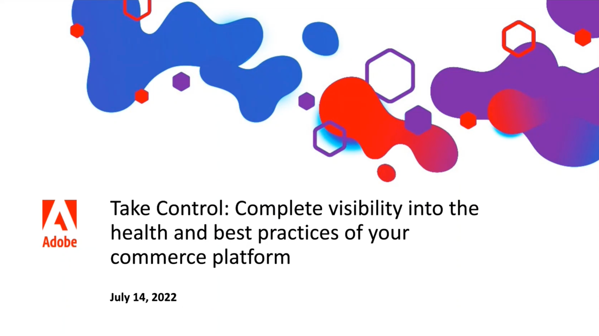
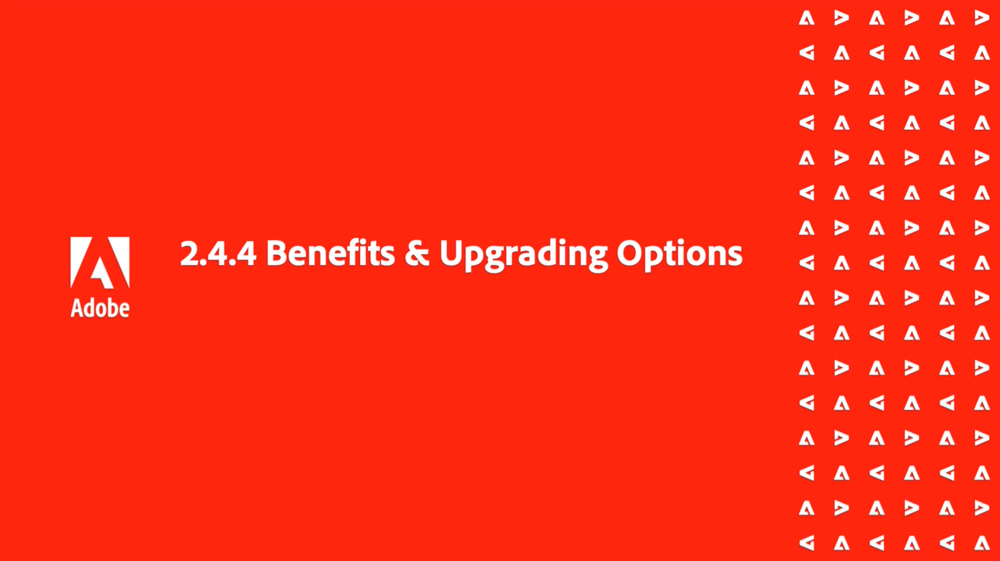

# APAC Commerce Webinar Series

The APAC Commerce Webinar Series is a monthly cadence of workshops for Adobe Commerce customers that covers a wide range of topics from best practices to product roadmap and industry trends. Hear from various product experts across the business and join live for an opportunity to ask questions and engage with the team directly. This series will help you to be successful on, and maximize your investment in the Adobe Commerce platform.

## What's New

<table>
<tr>
  <td>
    
     

      <a href="https://experienceleague.adobe.com/docs/commerce-events/events/apac-commerce/2022/analysis-tool.html">
        <strong>Adobe Commerce Site Wide Analysis Tool</strong>
      </a>
    

    

    <em>This webinar is ideal for merchants who want to get real-time access to all system insights, proactive steps to resolve any Adobe Commerce site problems and monitor overall site health.</em>
    

  </td>
  <td>
    
     

      <a href="https://experienceleague.adobe.com/docs/commerce-events/events/apac-commerce/2022/new-relic.html">
        <strong>New Relic Masterclass</strong>
      </a>
    

    

    <em>Join this webinar to learn how to take control of your infrastructure with New Relic. Approach your next campaign with absolute confidence by accessing and understanding your infrastructure data.</em>
    

  </td>  
  <td>
    
     

      <a href="https://experienceleague.adobe.com/docs/commerce-events/events/apac-commerce/2022/upgrade.html">
        <strong>Benefits of upgrading to Adobe Commerce 2.4.4</strong>
      </a>
    

    

    <em>The latest Adobe Commerce release marks a step forward in commerce capabilities, security and performance. Join this webinar to find out how to plan and execute a smooth upgrade to take advantage of the latest improvements.</em>
    

  </td>
</tr>
</table>

>[!TIP]
>
>**All recorded sessions are listed in the navigation on the left**.
