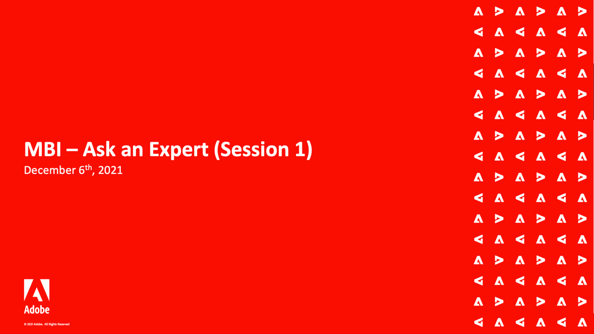
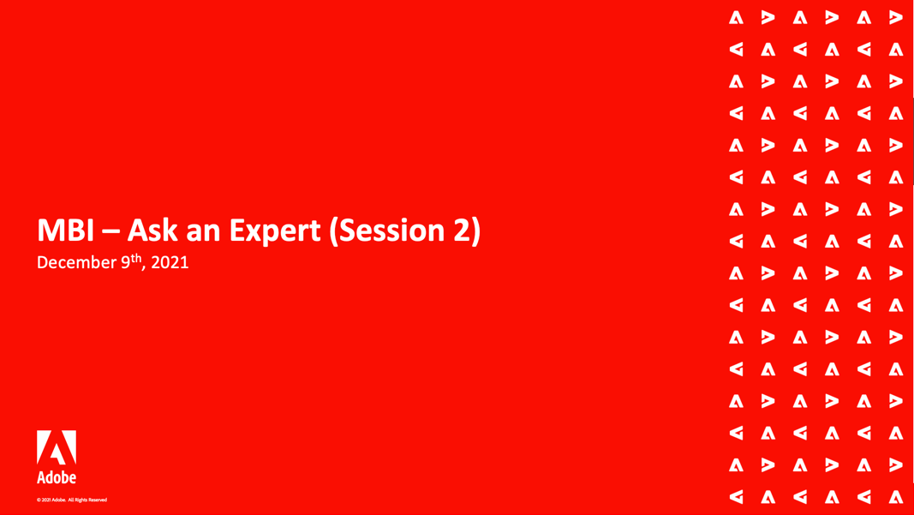

# MBI Webinars

The MBI webinar series is a periodic event for MBI customers. The webinars cover a wide range of topics and best practices for using MBI to its fullest potential.
Attendees from all geographies can join the events live to understand the product better and to get their questions on MBI functionality answered directly.
The topics are repeated occasionally to accommodate any new questions that the customers may ask.

## Staff picks

<table>
<tr>
  <td>
    
     

      <a href="https://experienceleague.adobe.com/docs/commerce-events/events/mbi/2021/optimize-data-warehouse.html">
        <strong>Optimize Your MBI Data Warehouse</strong>
      </a>
    

    

    <em>Using the Data Warehouse Manager, you can manage table and column sync settings, drill down into a table's schema, and create calculated columns to use in reports.</em>
    

  </td>
  <td>
    
     

      <a href="https://experienceleague.adobe.com/docs/commerce-events/events/mbi/2021/ask-expert.html?lang=en#session-1">
        <strong>MBI - Ask an Expert, Session 1</strong>
      </a>
    

    

    <em>Watch this recorded webinar for a deep dive with the MBI product team, including business transformation through intelligent data.</em>
    

  </td>
  <td>
    
     

      <a href="https://experienceleague.adobe.com/docs/commerce-events/events/mbi/2021/ask-expert.html?lang=en#session-2">
        <strong>MBI - Ask an Expert, Session 2</strong>
      </a>
    

    

    <em>Watch this recorded webinar for another deep dive with the MBI product team, including SQL optimization using common table expressions and best practices in SQL-based reports.</em>
    

  </td>
</tr>
</table>

>[!TIP]
>
>**All recorded webinars are listed in the navigation on the left**.

## Useful resources

- [MBI videos and tutorials](https://experienceleague.adobe.com/docs/commerce-learn/tutorials/mbi/filter-sets.html)
- [MBI User Guide](https://experienceleague.adobe.com/docs/commerce-business-intelligence/mbi/guide-overview.html)
